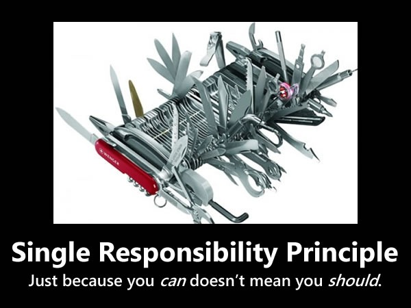

Principles
======

In short, where this principles actually pay off:

- Readability — Having simple objects defined based on what they do make our life a lot easier coming back to the code we wrote months ago.
- Testability — Since the signatures of the objects are well-defined and very much contained, creating unit and integration tests is super straightforward and fast.
- Robustness — Simple objects allow you to focus on the specificities of each task individually and reduces the amount of input/output variables you need to consider at any given time. Thus making the whole process less error-prone.
- Onboarding — This approach has proven itself very helpful when handing down knowledge as the thought process is like a standard line protocol instead of a wibbly wobbly mix of instructions.
- Caching Layers — For scaling scenarios, you can cache objects using solutions such as Redis just by adding 2/3 lines of code to an object. As such you don't need interfere with the rest of the codebase.
- Reusability — Given all the examples we've seen, I think this speaks for itself.
- Less Issues — Considerably reduces cyclomatic complexity, hence, reducing the amount of defects

Single Responsibility Principle
-------

Here is an example of violating this rule::

    class CarWashService:
        def __init__(self, sms_sender):
            self.sms_sender = sms_sender

        def __call__(self, card_id, customer_id):
            car = Car.objects.get(id=card_id)
            customer = Customer.objects.get(customer_id)
            if car.wash_required:
                car.washed = True
                self.sms_sender.send(mobile_phone=customer.phone, text=f"Car %{car.plate} whashed.")

After refactor::

    class CarWashService:
        def __init__(self, repository, notifier):
            self.repository = repository
            self.notifier = notifier

        def __call__(self, car_id, customer_id):
            car = self.repository.get_car(car_id)
            customer = self.repository.get_customer(customer_id)
            if car.wash_required:
                car.washed = True
                self.notifier.wash_completed(customer.phone, car.plate)

Open-Closed Principle
-------

example::

    class Rectangle(object):

        def __init__(self, width, height):
            self.width = width
            self.height = height

    class AreaCalculator(object):

        def __init__(self, shapes):

            assert isinstance(shapes, list), "`shapes` should be of type `list`."
            self.shapes = shapes

        @property
        def total_area(self):
            total = 0
            for shape in self.shapes:
                total += shape.width * shape.height

            return total
.. image:: _static/solid/oc.jpg

after refactor You can see that it will be easy to extend the functionality::

    from abc import ABCMeta, abstractproperty

    class Shape(object):
        __metaclass__ = ABCMeta

        @abstractproperty
        def area(self):
            pass

    class Rectangle(Shape):

        def __init__(self, width, height):
            self.width = width
            self.height = height

        @property
        def area(self):
            return self.width * self.height

    class AreaCalculator(object):

        def __init__(self, shapes):
            self.shapes = shapes

        @property
        def total_area(self):
            total = 0
            for shape in self.shapes:
                total += shape.area
            return total

Liskov Substitution Principle
-------

.. image:: _static/solid/ls.jpg

Interface Segregation Principle
-------

Dependency Inversion Principle
-------

``Depend of abstractions. Do not depend upon concretion.``

Example with Global State Problem, Implicit Dependency Problem and Concrete API::

    class CarWashService:
        def __init__(self, repository):
            self.repository = repository

        def __call__(self, car_id, customer_ids):
            car_wash_job = CarWashJob(car_id, customer_id)
            self.repository.put(car_wash_job)
            SMSNotifier.send_sms(car_wash_job)

.. image:: _static/solid/di.jpg

After refactor::

    class CarWashService:
        def __init__(self, notifier, repository):
            self.repository = repository
            self.notifier = notifier

        def __call__(self, car_id, customer_id):
            car_wash_job = CarWashJob(car_id, customer_id)
            self.repository.put(car_wash_job)
            self.notifier.job_completed(car_wash_job)

